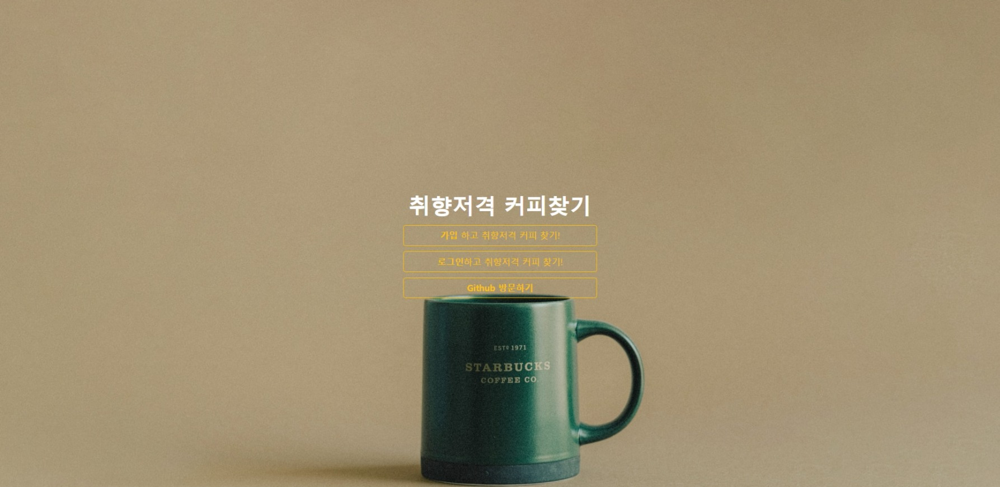

# Coffee-selector



> [사이트 방문하기](http://coffe-selector.shop/) - coffee-selector.shop <br>
> [유투브 영상 보기](https://youtu.be/PZmnmWDcpUE) - www.youtube.com/watch?v=PZmnmWDcpUE

- 제목 : '캡슐커피 취향저격'
- 설명 : 강도, 산미, 취향등에 선택에 따라 캡슐커피를 추천해주는 사이트
- 일정표 : [취향저격 커피추천 - git projects](https://github.com/users/unchaptered/projects/5)
- 서버 저장소 : [Coffee Selector - git repository](https://github.com/unchaptered/coffee-selector)
- 크롤링 저장소 : [Coffe Selector Selenium - git repository](https://github.com/unchaptered/coffee-selector-selenium)
- 기술 문서
    - Github 문법 [> Click](https://github.com/unchaptered/coffee-selector/blob/main/document/GIthub_syntax.md)
    - Github 커밋 규칙 [> Click](https://github.com/unchaptered/coffee-selector/blob/main/document/Github_commit_rule.md)
    - Jinja2 설명 [> Click](https://github.com/unchaptered/coffee-selector/blob/main/document/jinja2.md)
    - Troulbe 이슈 리스트 [> Click](https://github.com/unchaptered/coffee-selector/blob/main/document/trouble/trouble_issue.md)
        - Git 사용 어려움 [> Click](https://github.com/unchaptered/coffee-selector/blob/main/document/trouble/1.%20Git%20%EC%82%AC%EC%9A%A9%20%EC%96%B4%EB%A0%A4%EC%9B%80.md)
        - Git pull 할 때마다, Python 인터프리터 연결이 해제되는 경우 [> Click](https://github.com/unchaptered/coffee-selector/blob/main/document/trouble/2.%20Git%20pull%20%ED%95%A0%20%EB%95%8C%EB%A7%88%EB%8B%A4%2C%20Python%20%EC%9D%B8%ED%84%B0%ED%94%84%EB%A6%AC%ED%84%B0%20%EC%97%B0%EA%B2%B0%EC%9D%B4%20%ED%95%B4%EC%A0%9C%EB%90%98%EB%8A%94%20%EA%B2%BD%EC%9A%B0.md)
        - Nespresso 사이트 크롤링 거부 [> Click](https://github.com/unchaptered/coffee-selector/blob/main/document/trouble/3.%20Nespresso%20%EC%82%AC%EC%9D%B4%ED%8A%B8%20%ED%81%AC%EB%A1%A4%EB%A7%81%20%EA%B1%B0%EB%B6%80.md)
        - 팀원들 간에 특정 변수가 달라져야 했던 이유 [> Click](https://github.com/unchaptered/coffee-selector/blob/main/document/trouble/4.%20%ED%8C%80%EC%9B%90%EB%93%A4%20%EA%B0%84%EC%97%90%20%ED%8A%B9%EC%A0%95%20%EB%B3%80%EC%88%98%EA%B0%80%20%EB%8B%AC%EB%9D%BC%EC%A0%B8%EC%95%BC%20%ED%96%88%EB%8D%98%20%EC%9D%B4%EC%9C%A0.md)
        - MongoDB Atlas 함수가 작동하지 않았던 경우 [> Click](https://github.com/unchaptered/coffee-selector/blob/main/document/trouble/5.%20MongoDB%20Atlas%20%ED%95%A8%EC%88%98%EA%B0%80%20%EC%9E%91%EB%8F%99%ED%95%98%EC%A7%80%20%EC%95%8A%EC%95%98%EB%8D%98%20%EA%B2%BD%EC%9A%B0.md)
        - PyJwt.decode 가 AWS 에서만 에러가 일으키는 경우 [> Click](https://github.com/unchaptered/coffee-selector/blob/main/document/trouble/6.PyJwt.decode%20%EA%B0%80%20AWS%20%EC%97%90%EC%84%9C%EB%A7%8C%20%EC%97%90%EB%9F%AC%EA%B0%80%20%EC%9D%BC%EC%9C%BC%ED%82%A4%EB%8A%94%20%EA%B2%BD%EC%9A%B0.md)
    - Javascript 함수 설명
        - swithcer 함수 [> Click](https://github.com/unchaptered/coffee-selector/blob/main/document/javascript/switcher.md)
        - prototpye 이란 [> Click](https://github.com/unchaptered/coffee-selector/blob/main/document/javascript/prototype.md)
        - spread-destructuring 이란 [> Click](https://github.com/unchaptered/coffee-selector/blob/main/document/javascript/destructuring.md)
    - Pyhton 구현 설명
        - Authentication [> Click](https://github.com/unchaptered/coffee-selector/blob/main/document/python/Authentication.md)
- 프로젝트 기간 : `2022-07-11` ~ `2022-07-14` (4일 간)

<hr>

## 기여자

1. SilverTree 
2. crystal025 
3. JeungHoSub 
4. unchaptered

<hr>

## 폴더 구조

```cmd
root
├ static
│ ├ css
│ └ js
├ templates
│ ├ components
│ ├ layout
│ └ pages
├ src/modules
├ database.py
└ app.py
```

<hr>

## 모듈 리스트

| 모듈명 | 설명 |
| :----- | :--- |
| flask | 프레임워크 |
| Jinja2 | 탬플릿 엔진 |
| python-dotenv | 환경변수 출력 모듈 |
| PyJWT | JWT 토큰 모듈 |
| Bcrypt-Flask | 비밀번호 암호화 모듈(단방향) |

<hr>

## CDN 링크 모음

1. Bootstrap CSS
2. JQUery, Pooper, BootStrap JS

```javascript
<!-- Bootstrap CSS -->
<link rel="stylesheet" href="https://maxcdn.bootstrapcdn.com/bootstrap/4.0.0/css/bootstrap.min.css"
    integrity="sha384-Gn5384xqQ1aoWXA+058RXPxPg6fy4IWvTNh0E263XmFcJlSAwiGgFAW/dAiS6JXm"
    crossorigin="anonymous">

<!-- Optional JavaScript -->
<!-- jQuery first, then Popper.js, then Bootstrap JS -->
<script src="https://ajax.googleapis.com/ajax/libs/jquery/3.5.1/jquery.min.js"></script>
<script src="https://cdnjs.cloudflare.com/ajax/libs/popper.js/1.12.9/umd/popper.min.js"
    integrity="sha384-ApNbgh9B+Y1QKtv3Rn7W3mgPxhU9K/ScQsAP7hUibX39j7fakFPskvXusvfa0b4Q"
    crossorigin="anonymous"></script>
<script src="https://maxcdn.bootstrapcdn.com/bootstrap/4.0.0/js/bootstrap.min.js"
    integrity="sha384-JZR6Spejh4U02d8jOt6vLEHfe/JQGiRRSQQxSfFWpi1MquVdAyjUar5+76PVCmYl"
    crossorigin="anonymous"></script>
```