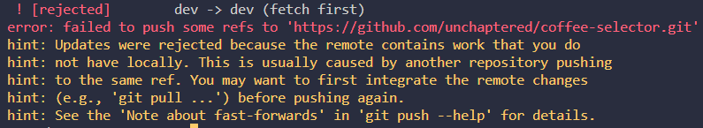
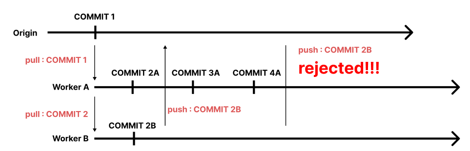

# Git 사용 어려움

> - author : 이민석(@unchapterd)

다수의 팀에서 마주했을 트러블 이라 생각되어서 **첫 번째** 로 작성했습니다.

1. F반 3조 의 개발 환경
2. 문제 상황 리스트
3. 문제 상황 해결 방법

<hr>

## 1. F반 3조 의 개발 환경

> branch 란?
>
> git 이 제공하는 기능 중 하나로, 여러 `분기점` 을 만들어서 **배포된 파일** 과 **수정 중인 파일** 을 분리하여 작업할 수 있게 해줍니다.
>
> 에러를 잡고 수정이 완료되면 main 브랜치로 **pull request(당김 요청)** 를 통해서 **merge(병합)** 할 수 있습니다.

<hr>

### 1.A. 브랜치 리스트 및 목적

- `main` : AWS 환경에서의 운용영 브랜치
- `dev` : 로컬 환경에서의 개발용 브랜치

<hr>

## 2. 문제 상황 리스트

저희는 `git bash` 를 이용한 커맨드 명령어와 `source tree` 를 이용한 사용이 있었습니다.

이에 관련해서 다음과 같은 **문제점** 들이 발생 하였고 또 해결했습니다.

- A 기본 명영어 의 낯섬
- B 새로운 로컬 폴더에서 연결하고 git pull 시에, main 외의 브랜치가 안딸려오는 현상
- C 깃 push 가 거부되는 경우
- D. 깃 충돌이 일어난 경우


<hr>

### 2.A. 기본 명영어 의 낯섬

문제 상황 발생 시 `화면 공유` 를 하거나 `구글링` 을 하는 것으로 문제를 해결하였습니다.

또 다양한 상황에서 마주했던 Git 관련된 이슈를 다음 파일에 정리해두었습니다.

- [Github 문법 상황별 정리 (로컬에서 클릭!)](../GIthub_syntax.md)
- [Github 문법 상황별 정리 (네트워크에서 클릭! - dev 브런치)](https://github.com/unchaptered/coffee-selector/blob/dev/document/Github_commit_rule.md)
- [Github 문법 상황별 정리 (네트워크에서 클릭! - main 브런치)](https://github.com/unchaptered/coffee-selector/blob/dev/document/Github_commit_rule.md)

<hr>

### 2.B. 새로운 로컬 폴더에서 연결하고 git pull 시에, main 외의 브랜치가 안딸려오는 현상

> 이미 네트워크 `원격 저장소` 에 main, dev 등의 복수의 브랜치가 있는 경우에 발생하였습니다.

git pull origin 혹은 git clone 을 통해서 `새 로컬 폴더` 에 깃을 받으면 main 브런치만 생성 되었습니다.

처음에는 `로컬` 에서 gti branch dev 로 브런치를 만들어서 연결하려 하였으나, 실패했습니다.

따라서, `로컬` 에서 git checkout dev 를 통해서 `원격` 의 dev 브런치와 동기화 하는 방법을 사용하였습니다.

<hr>

### 2.C. 깃 push 가 거부되는 경우

> 에러 창



#### ✅ 문제 정의

해당 문제는 `원격 Origin/dev` 의 최신 상태와 `로컬 dev` 의 최신 상태가 달라서 발생하는 문제입니다.



#### ✅ 해결 방법

1. git status 로 아직 git add, git commit 이 된 파일이 있는지 확인
    1. 있다면 변경사항 커밋(not push)
    2. 없다면 다음으로 진행
2. git fetch, git pull 로 최신 버전을 `dev(로컬)` 에 반영
3. git status 로 충돌이 일어났는지 확인 
    1. 다수의 파일에 변화가 있을 경우 : 충돌이 일어난 것이므로 `2.D 깃 충돌` 을 참고해주세요.
    2. 아무 것도 나오지 않을 경우 : 문제 없이 작업 시작

<hr>

### 2.D. 깃 충돌이 일어난 경우

> 충돌이란?
>
> 단일/다수 파일에 동시적 변화가 일어나서 `git` 시스템이 파일의 변화를 자동으로 추적하기 어려워서 충돌을 일으키고 이를 개발자에게 수정을 요청하는 등의 상태.

#### ✅ 문제 정의

발생 가능한 상황은 크게 2 가지가 있습니다.

1. 충돌이 발생하며 rejected : `단일 파일` 이 origin/dev 와 dev 에서 다른 경우
2. 그냥 rejected : `다른 파일` 이 origin/dev 와 dev 에서 다른 경우

충돌이라는 현상이 발생한 경우, git status 를 입력하면 다음과 같은 상태가 됩니다.

```cmd
both merged   app.py #충돌 발생
merged        app.py #충돌 없이 rejected 된 경우
modified      app.py #충돌 없이 rejected 된 경ㅇ
```

#### ✅ 문제 해결

위와 같이 변화가 감지된 모든 파일을 눌러서 확인해보면 됩니다.

그 중에서도 both merged 로 적혀있는 파일의 다음과 같은 이상한 문자열이 포함되어 있습니다.

```javascript
<<<<<< HEAD

가장 최신의 수정 파일

=======

구 버전의 수정 파일

>>>>>>>
```

가장 `최신` 이라는 말이 코드 상의 최신을 의미하는 것이 아닙니다.

깃에 가장 늦게 올라온 코드 줄이라는 것을 의미하기 때문에 둘 다 읽어봐야합니다.

읽어보고 올바른 부분을 남기고 나머지를 제거하는 것으로 `Conflict Merge, 병합 충돌` 을 해결할 수 있습니다.