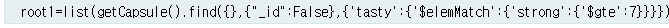
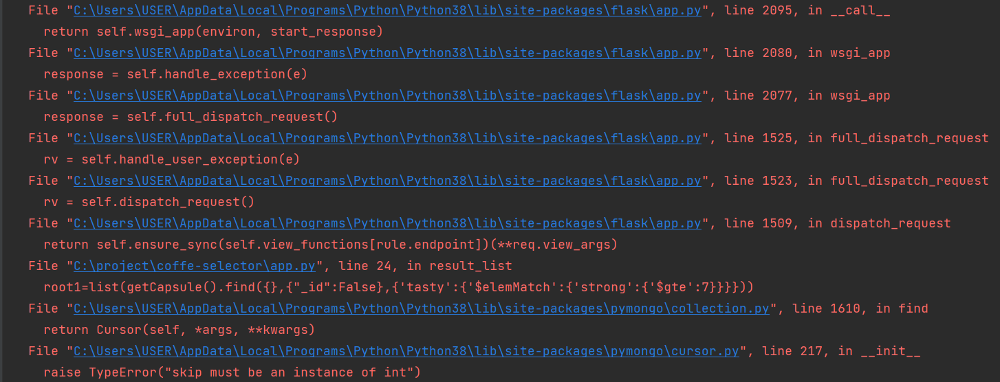
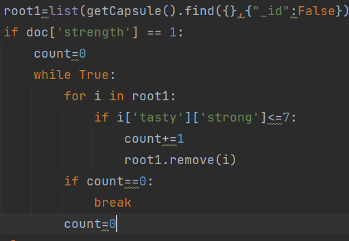
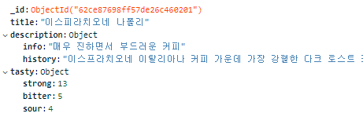

# MongoDB Atlas 함수가 작동하지 않았던 경우

> - author : 최성영(@cesdea)
# 문제1
> 
> 
> 
>> 문제1:mongoDB의 퀴리문이 제대로 작동하지 않았을때가 있었다 제어할 데이터의 형태는 {a,b:{object}}의 형태였는데 b의 object을 기준으로 find를 사용하여 데이터를 뽑아낼 예정이였다. 구글링을 하면서 퀴리문을 만들어지만 gte,lte와 같은 이상,이하를 포함시킬려고 했을때 문제 발생
> 
>> 해결: 퀴리문으로는 해결하지 못하여 변수에 데이터를 넣어 가공하는 과정을 거쳤다.
> 
> 
# 문제2
>>문제2:Mac환경에서 mongoDB가 작동되지 않는 문제가 발생함
> 
>>해결: trouble 2번에 일어난 인터프리터 증발때문에 제대로된 사용이 불가능, 임포트로 certifi을 불러서 해결
>
#문제3
> 
>     if doc['apple'] == 0:
>          for r in root1:
>            if r['tasty']['sour']>3:
>               root1.remove(r)
>     else:
>         for r in root1:
>           if r['tasty']['sour']<=3:
>               root1.remove(r)
>>문제3:위의 코드에서 sour으로 Key Error가 발생함
> 
>> 해결:아직도 원이 파악되지 않음
