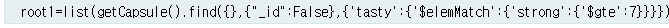
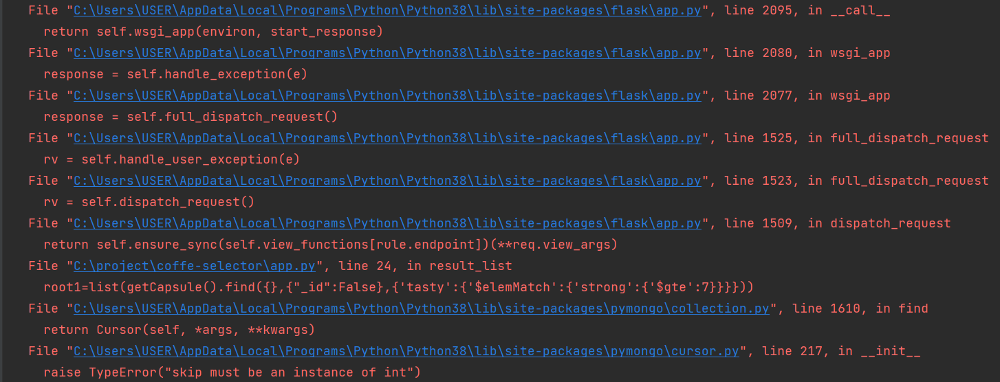
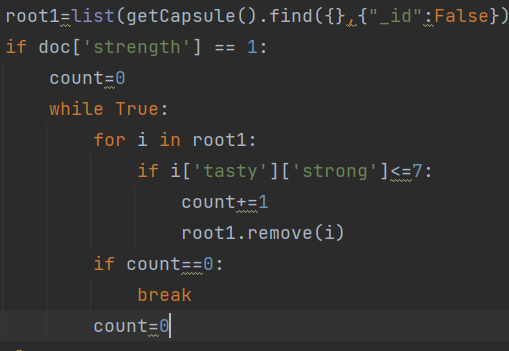
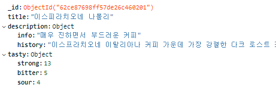

# MongoDB Atlas 함수가 작동하지 않았던 경우

> - author : 최성영(@cesdea)

<hr>

## 문제 상황 리스트

1. MongoDB 쿼리문의 오작동 A - 쿼리 operator 오작동
2. MongoDB 쿼리의 오작동 B - 특정 key 값이 호출되지 않음
3. Mac 환경에서 MongoDB 연결 불가 이슈

<hr>

### 1. MongoDB 쿼리문의 오작동 A

MongoDB 의 특정 쿼리문이 오작동을 일으켰습니다.

#### ✅ 문제상황
MongoDB 의 쿼리문이 제대로 작동하지 않았을 때가 있었습니다.

제어할 데이터의 형태는 {a,b:{object}}의 형태였는데 b의 object을 기준으로 find를 사용하여 데이터를 뽑아낼 예정이었습니다.

gte,lte와 같은 이상,이하를 포함시킬려고 했을때 문제 발생했습니다.

#### ✅ 스크린샷




#### ✅ 해결방법

pymongo 의 메서드나 쿼리문으로는 해결 하지 못하여, 가공 과정을 추가했습니다.




<hr>

### 2. MongoDB 쿼리의 오작동 B


#### ✅ 문제상황

```python
if doc['apple'] == 0:
        for r in root1:
        if r['tasty']['sour']>3:
            root1.remove(r)
else:
    for r in root1:
        if r['tasty']['sour']<=3:
            root1.remove(r)
```

#### ✅ 스크린샷



#### ✅ 해결방법

정확한 원인을 찾을 수 없었습니다.

<hr>

### 3. Mac 환경에서 MongoDB 연결 불가 이슈

트러블 리스트 2번의 `인터프리터` 이슈로 제대로된 사용이 불가능했습니다.

Mac 환경에서만 추가로 `certifi` 를 불러서 해결하였습니다.