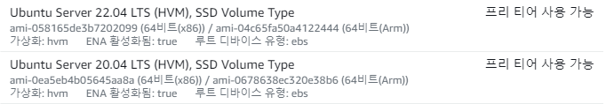

# PyJwt.decode 가 AWS 에서만 에러가 일으키는 경우

> - author : 이민석(@unchaptered), 신수정(@crystal025)

<hr>

## 참고 자료

[Typeerror: Object of type bytes is not JSON serializable 오류 해결](https://velog.io/@funnykyeon/Typeerror-Object-of-type-bytes-is-not-JSON-serializable-%EC%98%A4%EB%A5%98-%ED%95%B4%EA%B2%B0)
[jwt.encode fails with "Object of type 'bytes' is not JSON serializable](https://stackoverflow.com/questions/50104782/jwt-encode-fails-with-object-of-type-bytes-is-not-json-serializable)

<hr>

## 문제 상황

로그인 기능에서 `PyJWT@2.4.0` 을 사용하였습니다.

로컬 환경에서는 정상적으로 작동하는 것을 확인했으나,

AWS 서버 환경에서는 참고자료에서 언급한 인코딩 관련 에러가 발생했습니다.

<hr>

## 문제 추정

처음에는 코드 상에 문제가 있는 줄 알았으나 문제지점을 찾을 수 없었습니다.

그 와중에 AWS 환경에서는 별도로 decode('UTF-8') 처리를 해야 한다는 게시글을 발견했습니다.

하지만 로컬 환경에서 해당 코드를 추가할 시 에러가 발생해 서버가 가동되지 않았습니다.

즉, 게시글과 로컬의 **PyJWT 버전이 다른 것** 이라고 생각할 수 있었습니다.

따라서, AWS EC2 인스턴스의 PyJWT 버전을 `pip list` 로 확인해보았습니다.

```cmd
PyJWT 1.7.0
```

로컬 환경의 버전과 너무나 큰 차이가 있었고 해결방법이 필요했습니다.

<hr>

## 추가 가정

`2022-07-13` 에 EC2 인스턴스 배포를 시도하였습니다.



당시에 교안 대로 `ubuntu@2020.04 LTS` 를 설치하자고 협의하였습니다.

가장 최신 버전인 `ubuntu@2022.04 LTS` 를 설치하면 해당 문제가 해결될 것이라고 추정했습니다.

<hr>

## 해결방법

`ubuntu@2022.04 LTS` 로 인스턴스를 생성하고 처음부터 다시 설치하였습니다.

```cmd
PyJWT 2.6.0
```

위와 같이 버전이 달라진 것을 확인할 수 있었고 서버가 정상 가동되는 것을 확인하였습니다.
